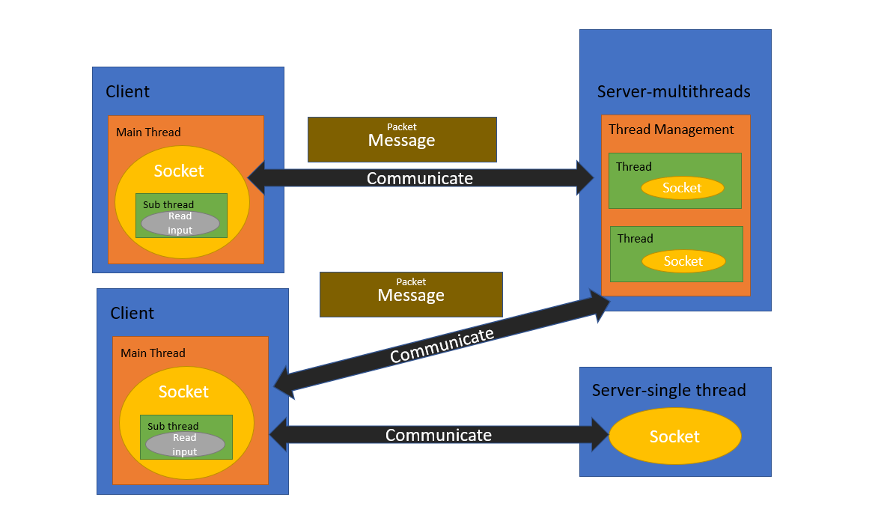

## Description
- Client can choose server to communicate, it can either be single thread or multiple threads server.
- Client will not start the sub thread if the client connects to the single thread because both of client and server will be closed after an echo.
- Client connects to multiple threads server can have options to use functions.
    - functions:
        - Have an echo with server.
        - Broadcast a message to all clients who are connecting with the server.
        - Send a message to a specific client, this need the ID of the receiver client.
- About Design:
    - See the overview diagram: 
    - Class Tree:
        ```
        ─hw2
        │  .editorconfig
        │  pom.xml
        │  README.md
        │
        ├─.vscode
        │      settings.json
        │
        ├─docs
        │      Design.PNG
        │
        ├─src
        │  └─main
        │      └─java
        │          └─com
        │              └─neu
        │                  ├─client
        │                  │      Client.java
        │                  │      SubClient.java
        │                  │
        │                  ├─multiThreading
        │                  │  └─server
        │                  │          Driver.java
        │                  │          Server.java
        │                  │          ServerImp.java
        │                  │          SocketThread.java
        │                  │          TCPServer.java
        │                  │          ThreadManagement.java
        │                  │
        │                  ├─response
        │                  │      Message.java
        │                  │      MessageType.java
        │                  │
        │                  └─singleThreading
        │                      └─server
        │                              Server.java
        ```
    - Server API is pre-designed for future use, something like the host of the server can system message to all the clients...

## How to get started
- Run the server first, the single thread server is under the folder singleThreading, run the main function of it. And the multiple threads server is under the folder multiThreading, you will see a Driver.java, run the main function.
- Then run client which is under the folder client, run the main function of Client.java.
- You will see the guidelines in terminal to do next step. As well as server will print logs as well.

- Notice: 
    - If the client connects with the single thread server, they will exit after an echo completed.
    - If the client connects to the multiple thread server, you need to pass the instruction to safely exit. The server will not end after client exited, you need to close it manually.
